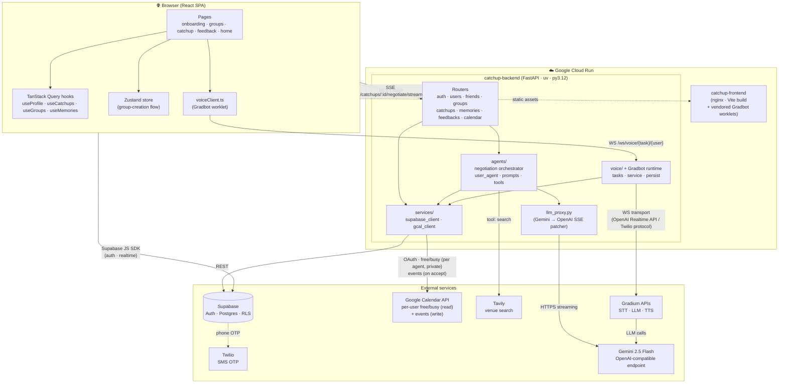
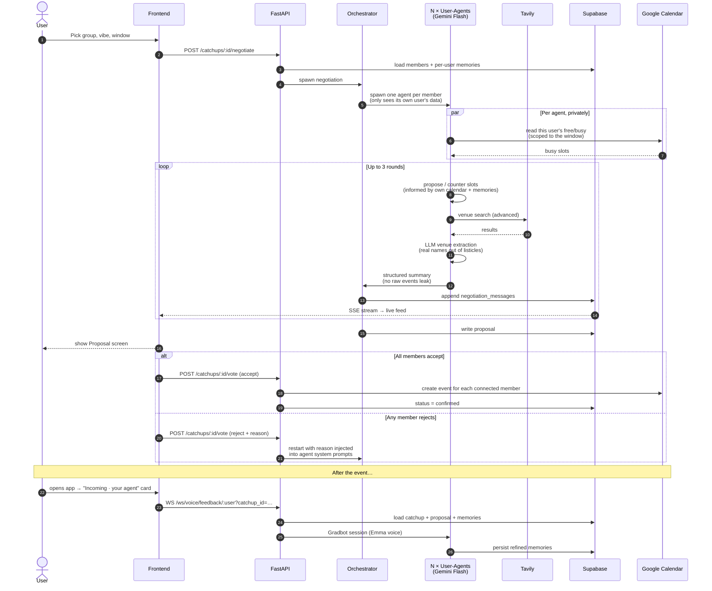

# Ketchup — your AI agent talks to your friends' so you actually see them

Ketchup is a multi-agent friend coordinator. Every user has a personal AI
agent that knows their schedule, their preferences, their relationships —
and negotiates on their behalf with their friends' agents to lock in a
catch-up everyone can show up to. The user opens the app, picks a window
and a vibe, and the agents do the rest: rounds of slot proposals, real
venue search, an honest compromise summary, a one-tap accept, and a
post-event voice debrief that refines what each agent knows.

The product moves the chat OUT of the group thread and INTO an
agent-to-agent layer. Coordination stops being a 30-message loop on
WhatsApp; it becomes "your agent already worked it out."

## The flow

1. **Voice onboarding (Gradbot).** First time you open the app, your
   agent calls you. Three quick questions: where you live, what blocks
   your week that isn't on your calendar, what your evening personality
   is. The LLM synthesises each answer into a clean third-person
   sentence and writes it to your profile as a memory.
2. **Calendar OAuth.** Optional Google Calendar connection so the agent
   can see your real free/busy and write the accepted catch-up directly
   onto your calendar. Scopes: `calendar.readonly` (free/busy) +
   `calendar.events` (event creation).
3. **Group + window.** Pick friends from your discoverable list, name
   the group, pick a vibe (dinner/drinks/brunch/activity), and pick a
   date range with the inline calendar.
4. **A2A negotiation (live SSE feed).** Backend spawns one agent per
   member. Up to 3 rounds of structured slot proposals — each agent only
   sees its own user's data; the orchestrator only sees structured
   summaries from each agent (privacy by separation, not by prompt
   instruction). Tavily is called with the merged venue criteria, the
   results are passed through a venue-extraction LLM pass that pulls
   real venue names out of "top 10" listicles. Agents rank, the
   orchestrator aggregates, the proposal is locked.
5. **Vote.** Accept — and Google Calendar events are pushed to every
   connected member. Reject — and the negotiation restarts with the
   rejection reason injected into every agent's system prompt so it
   actively avoids the failure mode (slot, venue, price band).
6. **Post-event debrief (Gradbot, again).** Once the event is past, the
   home page rings: an "incoming call" card from your agent. The agent
   already knows the venue, the friends, and your prior memories. It
   rebounds on what it thought it knew ("you had this place pegged as
   the cozy-bistro vibe — did it land?") and saves either confirmation
   or correction back into your profile.

Everything streams in real time over SSE: the user can watch the agents
debate, see who's flexing on which slot, and see Tavily go look for
places.

## Architecture

Two services on Cloud Run: an nginx-served React SPA and a FastAPI
backend. The backend owns three concerns: a thin REST/SSE layer over
Supabase, an in-process multi-agent negotiator built around Gemini Flash
and Tavily, and a Gradbot-backed voice WebSocket for onboarding and
post-event debriefs.

Privacy is enforced by **separation, not by prompt instruction**. Each
per-user agent reads its own user's Google Calendar free/busy *privately*
before proposing slots, and only ever shares structured summaries with
the orchestrator. The orchestrator never sees raw events, raw memories,
or any other user's calendar. It only sees "agent X prefers Thursday
20:00 because of these constraints."

Voice runs through **Gradbot**, an open-source framework for vibecoding
and prototyping voice agents on top of Gradium's STT/LLM/TTS APIs.
Gradbot's WebSocket transport is OpenAI Realtime API compatible and
also speaks the Twilio protocol, which is what makes it pluggable
between a browser worklet (us) and a phone call (future work).

### System overview



### A2A negotiation sequence

The heart of the product: when a user launches a catch-up, the backend
spawns one agent per group member, runs up to three rounds of
proposal/counter, streams each turn to the UI over SSE, and locks a
proposal once the orchestrator finds consensus. Rejection restarts the
loop with the rejection reason injected into every agent's system prompt
so the failure mode is actively avoided.



## Built for the Build Berlin hackathon

We ran on the four official partner stacks:

- **Google DeepMind — Gemini.** Every agent (per-user negotiator,
  orchestrator, venue extractor, post-call summariser) is a Gemini Flash
  call via the OpenAI-compatible endpoint. We wrote a small in-process
  proxy that patches Gemini's streaming `tool_calls` deltas (Gemini
  omits the per-tool `index` field) so they parse cleanly upstream.
- **Gradium — Gradbot.** The voice onboarding and post-event debrief
  both run inside a Gradbot session (browser ↔ FastAPI WebSocket ↔
  Gradbot's STT → LLM → TTS pipeline). We're using Emma (EN-F) as the
  agent voice and the bundled audio worklet client.
- **Twilio.** SMS-based phone verification on first sign-in, fronted by
  Supabase Auth (`signInWithOtp` → `verifyOtp`).
- **Tavily.** All venue discovery. We call Tavily in `advanced` depth
  mode, then run a downstream LLM pass that extracts ACTUAL venues from
  the often-listicle results so agents end up ranking real places, not
  blog post titles.

## Stack

| Layer        | Tech                                                          |
| ------------ | ------------------------------------------------------------- |
| Frontend     | React 18 + Vite + TypeScript + Tailwind, shadcn/ui            |
| State        | Zustand (group-creation flow), TanStack Query (server state)  |
| Auth         | Supabase Auth (phone OTP via Twilio)                          |
| Backend      | FastAPI + uv (Python 3.12)                                    |
| Database     | Supabase (Postgres, RLS, Realtime)                            |
| Voice        | Gradbot (browser worklet + Gradium STT/TTS)                   |
| LLM          | Gemini 2.5 Flash via OpenAI-compatible endpoint               |
| Search       | Tavily Python SDK                                             |
| Calendar     | Google Calendar API (OAuth authorization-code, refresh token) |
| Hosting      | Cloud Run (frontend + backend, europe-west1)                  |
| Streaming    | sse-starlette (live negotiation feed)                         |

## Live URLs

- Frontend: <https://catchup-frontend-157858425544.europe-west1.run.app>
- Backend:  <https://catchup-backend-157858425544.europe-west1.run.app>

## Repo layout

```
ketchup-catch-up/
├── src/                      # Frontend (Vite SPA)
│   ├── pages/                # Route-level screens (onboarding, catchup, feedback, …)
│   ├── components/           # shadcn-based UI primitives + Avatar/LiveLevels/…
│   ├── hooks/                # useProfile, useCatchups, useGroups, useMemories, …
│   ├── lib/                  # api client, voiceClient (Gradbot), supabase, devLogin
│   └── store/                # group-creation flow (Zustand)
├── backend/
│   ├── src/
│   │   ├── main.py           # FastAPI app + voice WebSocket
│   │   ├── routers/          # auth, users, groups, catchups, calendar, memories, …
│   │   ├── services/         # supabase_client, gcal_client (OAuth + freeBusy + events)
│   │   ├── voice/            # tasks (prompts/schemas), service (Gradbot session), persist
│   │   ├── agents/           # negotiation orchestrator, prompts, llm_client, tools
│   │   └── llm_proxy.py      # in-process Gemini→OpenAI SSE patcher
│   ├── migrations/           # incremental SQL migrations on top of supabase_migration.sql
│   └── scripts/              # seed_demo_users.py, clean_test_users.py
├── public/static/js/         # Vendored Gradbot worker bundles (same-origin)
├── Dockerfile + nginx.conf   # Frontend container
└── backend/Dockerfile        # Backend container
```

## Demo paths (judge cheat-sheet)

| What you want to show | What to click                                                          |
| --------------------- | ---------------------------------------------------------------------- |
| First-time onboarding | `/onboarding/welcome` → "Dev login (skip SMS)" → name → voice call     |
| New catch-up + A2A    | Home → "+ New catch-up" → pick Léa + Tom → window → "Launch my agent"  |
| Reject + restart      | Proposal screen → "Refuse" → choose reason → see negotiation restart   |
| Calendar push         | Accept proposal → "Skip to after the event (demo)" → check GCal        |
| Post-event debrief    | After the demo skip, Home shows an "Incoming · your agent" call card   |
| Memory + settings     | Top bar gear icon → Settings → see memories grouped by scope           |

## Local dev

```bash
# Backend
cd backend
cp .env.example .env       # then fill the keys
uv sync
uv run uvicorn src.main:app --reload --port 8000

# Frontend (in another terminal, from repo root)
npm install
npm run dev                # http://localhost:8080
```

The frontend dev server uses Vite for HMR, with `/api/audio-config` and
`/ws` proxied to the backend so the browser sees them same-origin (Web
Workers refuse cross-origin URLs even with CORS allow-all).

## Built by

Two devs, 24 hours, fuelled by ketchup metaphors and the shared
suspicion that group chats are not the answer.
